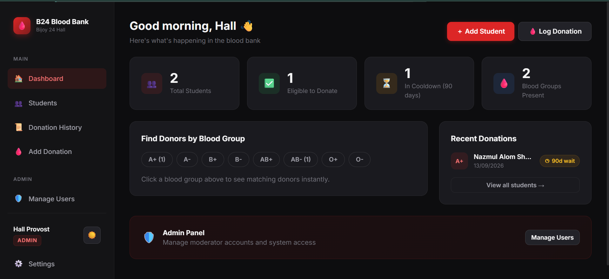

# 🩸 BloodBank Admin

A modern, edge-deployed blood donation management system. Originally built for **Bijoy 24 Hall (Dhaka College)**, this system is designed to help university dormitories, communities, and organizations easily track donors, manage blood groups, and log donation history in a fast and secure way.



## ✨ Features

- 👥 **Donor Directory**: Track students, their blood groups, room numbers, and contact info.
- 🕒 **Eligibility Tracking**: Automatically determines if a student is eligible to donate based on their last donation date (e.g., 120-day cooldown).
- 📜 **Global Donation Ledger**: A centralized history of all blood donations.
- 🛡️ **Role-Based Access Control**: Secure login system with `Admin` and `Moderator` roles using Edge-compatible JWTs.
- ⚡ **Edge-Native Performance**: Runs completely on the edge using Cloudflare Pages and D1 (Serverless SQLite) for near-instant load times.
- 🎨 **Modern Aesthetics**: A premium UI with dark/light mode, smooth micro-animations, and glassmorphism.

## 🛠️ Tech Stack

- **Framework**: [Next.js (App Router)](https://nextjs.org/)
- **Database**: [Cloudflare D1](https://developers.cloudflare.com/d1/) (SQLite)
- **Deployment**: [Cloudflare Pages](https://pages.cloudflare.com/) (using `@cloudflare/next-on-pages`)
- **Package Manager**: [Bun](https://bun.sh/)
- **Authentication**: Custom JWT implementation using `jose`

---

## 🚀 Getting Started

### 1. Prerequisites
- [Bun](https://bun.sh/) installed locally.
- A [Cloudflare](https://dash.cloudflare.com/sign-up) account.
- [Wrangler CLI](https://developers.cloudflare.com/workers/wrangler/install-and-update/) installed (`npm install -g wrangler`).

### 2. Clone and Install
```bash
git clone https://github.com/your-username/blood-admin.git
cd blood-admin
bun install
```

### 3. Database Setup (Cloudflare D1)
Create a new D1 database via the Cloudflare dashboard or wrangler:
```bash
npx wrangler d1 create hobby
```
Update your `wrangler.toml` with the newly generated `database_id`.

Apply the database schema:
```bash
npx wrangler d1 migrations apply DB --local # For local development
npx wrangler d1 migrations apply DB --remote # For production
```

### 4. Create an Admin Account
Edit `scripts/seed-admin.mjs` to include your desired Admin Name, Email, and Password. Then generate the SQL seed query:
```bash
node scripts/seed-admin.mjs
```
Run the generated SQL command using wrangler to insert your admin user into the database.

### 5. Run Locally
Start the development server using the Cloudflare proxy (so D1 works locally):
```bash
bun run dev
```

---

## 🌍 Production Deployment

This project is built specifically to be deployed on **Cloudflare Pages**.

1. Create a project on Cloudflare Pages and connect your GitHub repository.
2. Set the build command to `bun run pages:build`.
3. Set the build output directory to `.vercel/output/static`.
4. Bind your D1 database to the variable name `DB`.
5. **CRITICAL**: Add an environment variable named `JWT_SECRET` in Cloudflare Pages and set it to a strong, random string.

## 🤝 Contributing
Contributions are welcome! If you want to adapt this for your own organization, feel free to fork the project and customize it.

## 📝 License
This project is open-source and available under the [MIT License](LICENSE).
